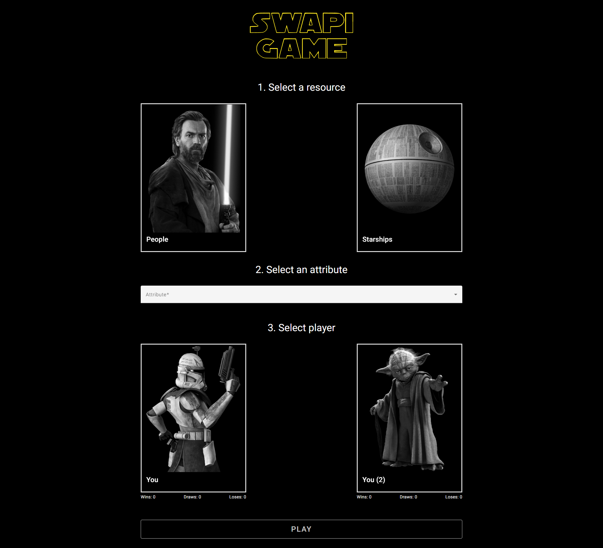
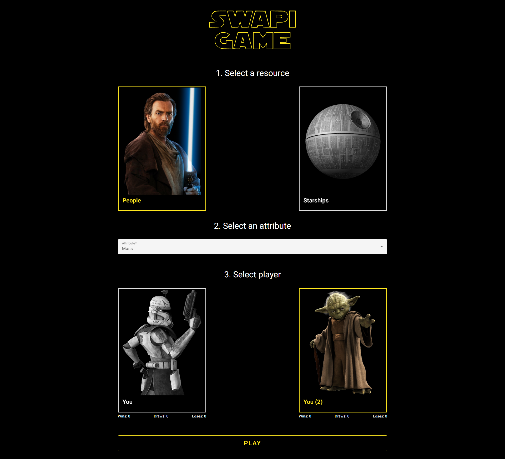
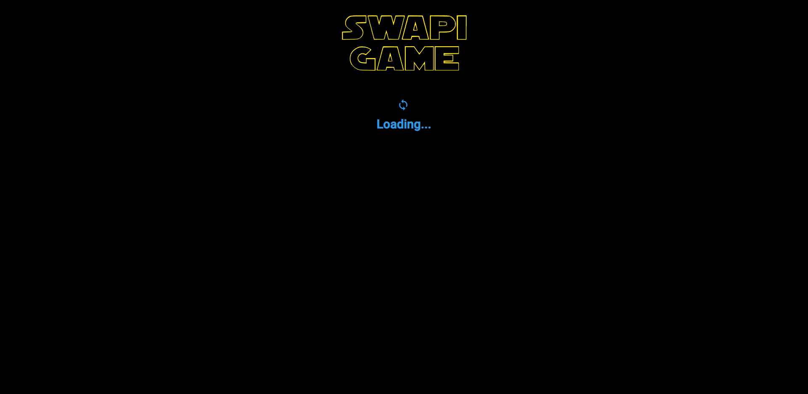
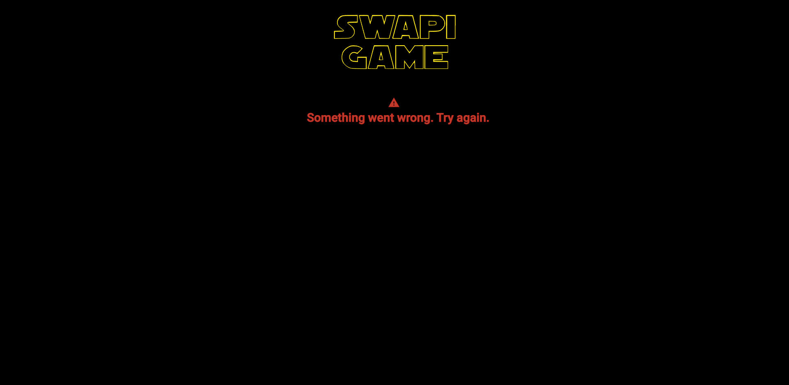
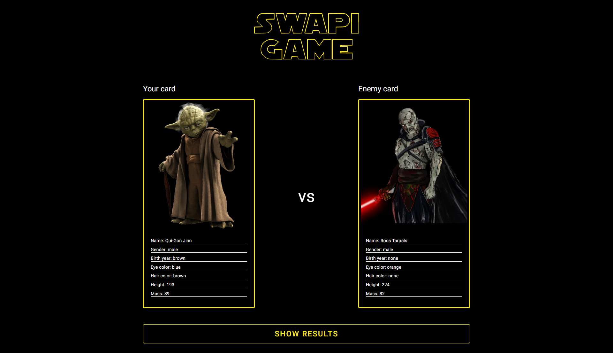
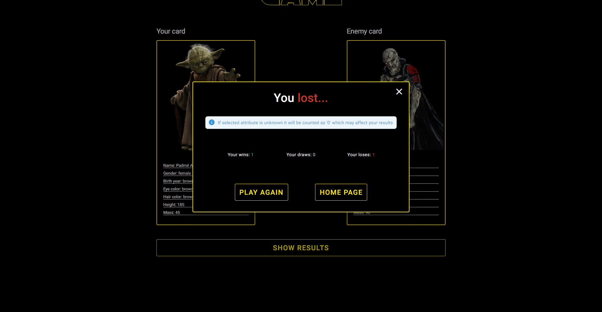
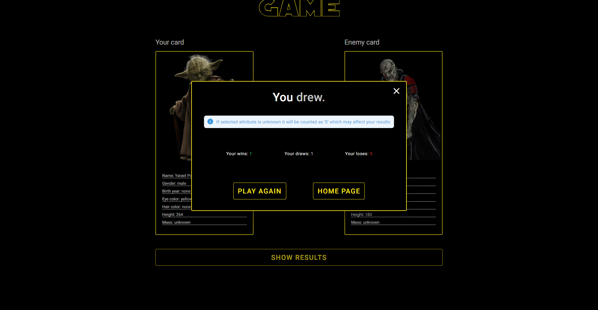
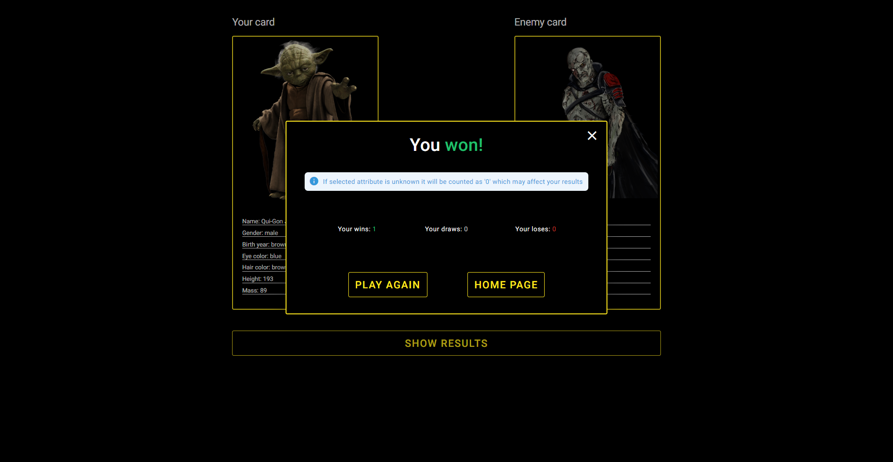

<h1 align="center">SWAPI Game</h1>

<h5 align="center">
	Made by: 
	<a href="https://www.linkedin.com/in/karol-modzelewski/" target="_blank">Karol Modzelewski</a>
</h5>

## Navigation

- [Getting started](#getting-started)
	* [Goal of this application](#goal-of-this-application)
	* [Download application](#download-application)
	* [Run application](#run-application)
	* [Helpful commands](#helpful-commands)
- [Tools and technologies](#tools-and-technologies)
- [Quick overwiew](#quick-overwiew)
  * [Home Page](#home-page)
  * [Game Page](#game-page)
  * [Results](#results)
- [Any questions?](#any-questions)

## Getting started

### Goal of this application:

The point of this application was to integrate with SWAPI api and to create some kind of random game based on selected attribute, then present it on second view and show the results. You win if your selected attribute value is higher than your enemy

### Download application:
 1. Download repository or clone it using `git clone https://github.com/karolmodzelewski/swapi-game.git` command in your empty folder
 2. Install all dependencies `npm i`

### Run application:
 - `npm run start` or `ng serve` -  runs on `localhost:4200`

### Helpful commands

- `npm run test` - run all tests
- `npm run test:coverage` - run tests coverage
- `npm run test` - run all tests
- `npm run e2e:open` - open cypress e2e tests
- `npm run e2e:run` - run e2e tests
- `npm run lint:fix` - lint application and automatically fixes errors and warnings (if it's supported by specific rules)
- `npm run format` - prettify application

## Tools and technologies

 - Angular 15
 - Angular Material 15
 - RxJS 7
 - TypeScript 4
 - Karma 6
 - Jasmine 5
 - Cypress 11
 - ESLint

## Quick overview

### Home Page

| Home Page Not Filled Form |
| --- |

| Home Page Filled Form |
| --- |

### Game Page

| Game Page Loading |
| --- |

| Game Page Error |
| --- |

| Game Page Success |
| --- |

### Results

| Results Popup Lost |
| --- |

| Results Popup Draw |
| --- |

| Results Popup Win |
| --- |

## Any questions?

If you have any questions or found some bugs or anything, feel free to contact me - I will be happy to answer :)
